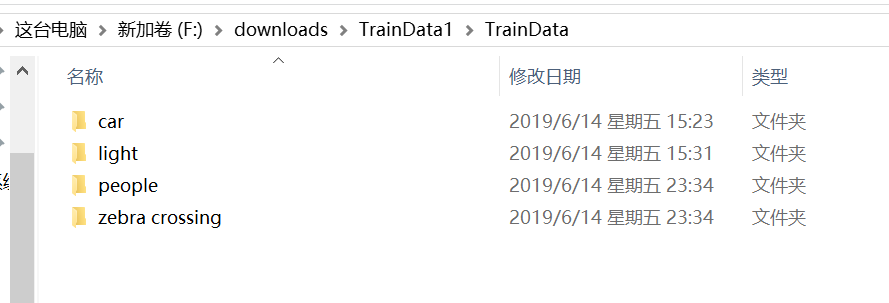

# -
matlab做的车载识别系统

PREPARATION
==========
    1、download dataset from internet or use your own dataset,please remember to name with its category ,etc car human
    ...,put all folder     file into one folder named by "traindata",mine is following one.

    
    
    
    2、run step by step in Food_Identification.m until line 135 .Remember to save net and testDS.
    location of dataset is in line 11 . the other parameter alter as ur wish.
   
   3、run the window.m and click "分类" ,outcome like this
   
